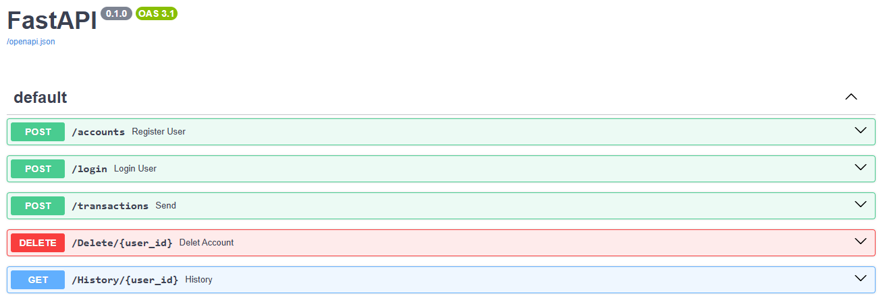

# $${\color{blue}\text{🏦 Secure Bank API}}$$
### A high-performance, professional **Banking REST API** featuring JWT Authentication, Environment Security, and SQLAlchemy ORM.

This project represents a major evolution in backend engineering, implementing **Industry-Standard Security Protocols** and a structured **Enterprise Architecture** focused on data protection and scalability.


> [!CAUTION]
> ### ⚠️ Project Under Active Development
> This system receives frequent updates (typically every 3 days or less). Any unexpected behavior or incomplete information is due to this continuous process of improvement, refactoring, and security enhancement.

---

## 🟦 Project Overview

The **project** is a robust backend system designed for secure financial operations. It utilizes **JWT (JSON Web Tokens)** for stateless authentication and **Bcrypt** for password hashing, ensuring that user data and transactions remain protected against unauthorized access.

### 🟦 Key Engineering Focus:
- **JWT Authentication:** Secure identity verification using Bearer Tokens for sensitive operations.
- **Environment Security:** Protection of sensitive credentials (Keys and Database URLs) via `.env` files.
- **Identity Locking:** Security logic that prevents users from performing operations (like transfers or history checks) on accounts they do not own.
- **ORM Integration:** Powered by **SQLAlchemy** for advanced database abstraction and security.
- **Financial Precision:** Implementation of `Numeric(10, 2)` types to eliminate floating-point rounding errors.

---

## 🟦 Main Features

### 🔐 Advanced Security & Auth
- **JWT Tokens:** Implementation of `python-jose` for generating and validating secure access tokens.
- **Bcrypt Hashing:** Password protection using salt-based hashing to prevent rainbow table attacks.
- **Secure Routes:** Protection of endpoints via Header Token verification and Payload decoding.
- **Environment Protection:** Implementation of `python-dotenv` to keep secrets out of version control.

### 💰 Professional Financial Engine
- **Transactional Safety:** Full ACID compliance for money transfers using SQLAlchemy sessions.
- **Decimal-Based Calculations:** Precise fund management using the `Decimal` library to avoid cent loss.
- **Audit Trail:** Automated transaction logs for every movement between accounts.

### 🛠️ Professional Documentation
- **Swagger UI Integration:** Interactive API documentation available at the `/docs` endpoint.
- **Google Style Docstrings:** High-level code explanation directly in the source files.

---

## 🛠️ Technologies Used

- **Framework:** [FastAPI](https://fastapi.tiangolo.com/)
- **Authentication:** JWT (JSON Web Tokens)
- **Security:** Bcrypt (Passlib) & python-jose
- **ORM:** [SQLAlchemy](https://www.sqlalchemy.org/)
- **Language:** Python 3.13+
- **Environment Management:** Python-dotenv
- **Data Validation:** Pydantic

---

## 📸 API Preview

### **Documentation & Testing:** Real-time testing of all endpoints via auto-generated Swagger interface.



---

## 📖 Quick Guide (Endpoints)

1. **`POST /accounts`**: Register a new account.
2. **`POST /login`**: Authenticate and receive an **Access Token**.
3. **`POST /transactions`**: Transfer funds (Requires valid Token & matching Sender ID).
4. **`GET /History/{user_id}`**: Retrieve transaction history (Requires valid Token).
5. **`DELETE /Delete/{user_id}`**: Secure account termination with credential verification.

---

## 🛠️ Local Setup (For Developers)

<details>
  <summary>Click to see how to run this project on your machine</summary>

  1. **Clone the repo:**
     ```bash
     git clone [https://github.com/ViniciusSantos-Tech/Python-bank-system.git](https://github.com/ViniciusSantos-Tech/Python-bank-system.git)
     ```
  2. **Install requirements:**
     ```bash
     pip install -r requirements.txt
     ```
  3. **Setup Environment Variables:**
     - Copy `.env.example` to a new file named `.env`.
     - Fill in your `SECRET_KEY` and `DATABASE_URL`.
     
  4. **Run the API:**
     ```bash
     uvicorn main:app --reload
     ```
  5. **Access Documentation:**
     Open `http://127.0.0.1:8000/docs` in your browser.

</details>


### Developed with ❤️ by **Vinícius Santos-Tech**
