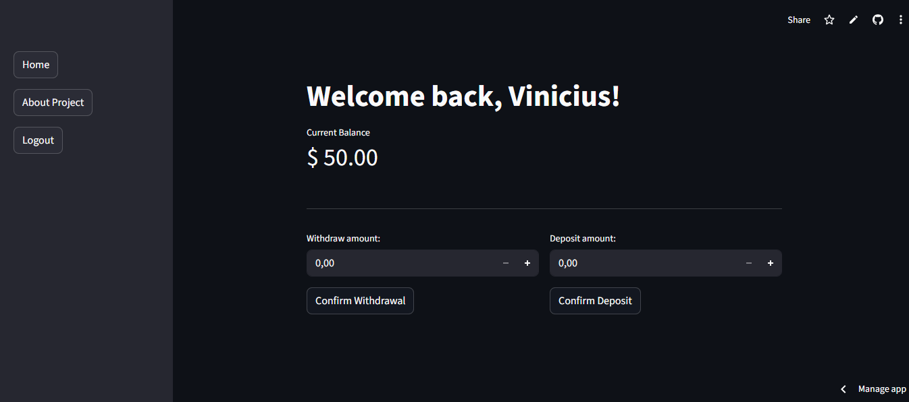

# $${\color{blue}\text{🏦 Python Bank System}}$$
### A modern, interactive, and secure **web banking application** built with Python, SQLite, and Streamlit.  
This project showcases the evolution from a simple CLI system to a **full interactive web interface**, focusing on **OOP**, **database persistence**, and **state management**.


---
## 🧠 Project Overview

The project is a study-driven yet professional-grade project designed to simulate the **core backend logic of a real banking system**.

Although the application includes a web interface built with **Streamlit**, the **main focus of this project is backend engineering**, including:

- **Business rules implementation:** Complex logic for transfers between accounts.  
- **Database modeling:** Relational storage for users, passwords, and balances.  
- **Register logic:** Validating unique identifiers (CPF) and creating new records.  
- **Object-Oriented architecture:** Modular code using `Bank`, `Login`, and `Register` classes.  

The UI exists **only to demonstrate and test the backend logic in a realistic environment**.

## 🌐 Deploy
[](https://python-bank-system-2ymuuuwsrs85wpl32blgxu.streamlit.app/)

> [!CAUTION]
> ### ⚠️ Access Credentials Required
> To explore the features of the Live Demo, you can **register your own account** or use the following pre-registered test credentials:
>
> - **Username:** `Marcus`
> - **Password:** `21345`

---

## 🚀 Key Features

### 🔐 Authentication & Registration
- **User Registration:** Dynamic account creation with CPF validation.
- **Session Control:** Secure login and persistence using Streamlit Session State.
- **Switch Account:** Easy logout to test transfers between different users.

### 💰 Banking Operations
- **Account Transfer:** Send money instantly to any user using their unique **ID Key**.
- **Real-time Balance:** Instant visual feedback and balance updates after transactions.
- **Visual Rewards:** Integrated animations (balloons) for successful transfers.

### 📊 Database & Security
- **SQLite Persistence:** All user data is stored in a local **SQLite (`bank.db`)** database.
- **Parameterized Queries:** Protects the system against **SQL Injection** attacks.

> [!NOTE]
> This project is under **active development**.  
> New features like Transaction History and Password Hashing are coming soon! 🚀

---

## 🛠️ Technologies Used

- **Language:** Python 3.x  
- **Web Framework:** Streamlit  
- **Database:** SQLite3  
- **Concepts & Skills:**
  - Object-Oriented Programming (OOP)
  - CRUD Operations (Create, Read, Update, Delete)
  - Relational Database Management
  - State Handling in Web Apps

---

## 📸 Application Preview

### **Register & Login:** Users can create their own accounts or use existing credentials.


### **Main Dashboard:** Displays the current balance and provides tabs for sending money or checking your personal Key.


> **Acesse a versão online para testes rápidos.**
### 🌐 [Click here to Open the Live App](https://python-bank-system-2ymuuuwsrs85wpl32blgxu.streamlit.app/)

---

## 📖 Quick Guide (How to Test)
1. Open the **Live App** link above.
2. Go to **Register** and create a new account (or use the test credentials).
3. Check your **ID Key** in the 'My Key' tab.
4. Logout and enter with another account to **Send Money** to your first account's ID.
5. Watch the balance update in real-time!

---

## 🛠️ Local Setup (For Developers only)
<details>
  <summary>Click to see how to run this project on your machine</summary>

  1. **Clone the repo:**
     ```bash
     git clone [https://github.com/ViniciusSantos-Tech/python-bank-system.git](https://github.com/ViniciusSantos-Tech/python-bank-system.git)
     ```
  2. **Install requirements:**
     ```bash
     pip install streamlit
     ```
  3. **Run the app:**
     ```bash
     streamlit run bank_system.py
     ```

</details>

---
### Developed with ❤️ by **Vinícius Santos-Tech**
